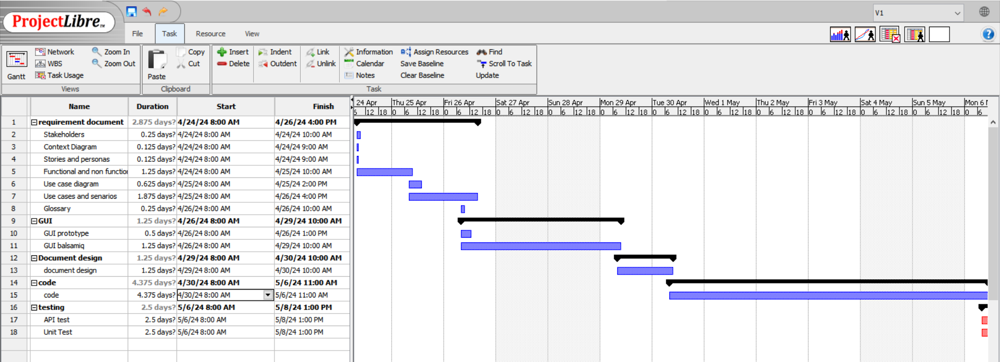

# Project Estimation - CURRENT
Date:

Version:

# Estimation approach
Consider the EZElectronics  project in CURRENT version (as given by the teachers), assume that you are going to develop the project INDEPENDENT of the deadlines of the course, and from scratch
# Estimate by size
### 
|             | Estimate                        |             
| ----------- | ------------------------------- |  
| NC =  Estimated number of classes to be developed   |               8              |             
|  A = Estimated average size per class, in LOC       |              100              | 
| S = Estimated size of project, in LOC (= NC * A) |            800           |
| E = Estimated effort, in person hours (here use productivity 10 LOC per person hour)  |                 80                     |   
| C = Estimated cost, in euro (here use 1 person hour cost = 30 euro) |  1200  | 
| Estimated calendar time, in calendar weeks (Assume team of 4 people, 8 hours per day, 5 days per week ) | 80/4 =  20 hours per person  20/8 = 2.5 Days   --> Almost half a Week|               

# Estimate by product decomposition
### 
|         component name    | Estimated effort (person hours)   |             
| ----------- | ------------------------------- | 
|requirement document    | 45 |
| GUI prototype |15|
|design document |20|
|code |80|
| unit tests |20|
| api tests |20|
| management documents  |30|

# Estimate by activity decomposition
### 
|         Activity name    | Estimated effort (person hours)   |             
| ----------- | ------------------------------- | 
| **requirement document** | |
| Stakeholders |2 |
| Context Diagram |1 |
| Stories and personas  |1 |
| Functional and non functional requirements|10 |
| Use case diagram| 5|
|Use cases and senarios|15|
|Glossary |2 |
| Deployment Diagram| 2|
|**GUI ** | |
| GUI prototype| 3|
| GUI design on Balsamiq| 10|
|**design document** | |
|design document | 10|
|**code** | |
|code | 40 |
|**Testing** | |
|Unit Test | 20|
|API Test |20 |
###

# Summary

The results are different due to the unique perspectives and criteria used in each method: activity-focused effort, product feature complexity, and project size metrics.
For example weekends / Holidays /  working hours (8 to 12 / 14 to 18) / overlabs of jobs may not be counted in some estimates. 

|             | Estimated effort                        |   Estimated duration |          
| ----------- | ------------------------------- | ---------------|
| estimate by size |80 person hour|  about half a week |
| estimate by product decomposition |230  person hour|about 1 week|
| estimate by activity decomposition |144  person hour|about 1 week|

