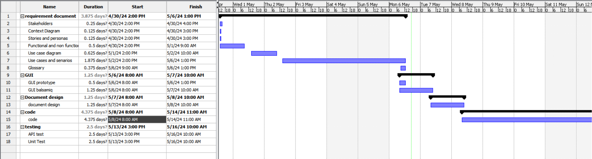

# Project Estimation - FUTURE
Date:

Version:

# Estimation approach
Consider the EZElectronics  project in FUTURE version (as proposed by your team in requirements V2), assume that you are going to develop the project INDEPENDENT of the deadlines of the course, and from scratch (not from V1)
# Estimate by size
### 
|             | Estimate                        |             
| ----------- | ------------------------------- |  
| NC =  Estimated number of classes to be developed   |               10              |             
|  A = Estimated average size per class, in LOC       |              150              | 
| S = Estimated size of project, in LOC (= NC * A) | 1500 |
| E = Estimated effort, in person hours (here use productivity 10 LOC per person hour)  |                   150                   |   
| C = Estimated cost, in euro (here use 1 person hour cost = 30 euro) | 4500 | 
| Estimated calendar time, in calendar weeks (Assume team of 4 people, 8 hours per day, 5 days per week ) |    150/4 =  37.5 hours per person  37.5/8 = 4.6 Days   --> Almost 1 Week              |               

# Estimate by product decomposition
### 
|         component name    | Estimated effort (person hours)   |             
| ----------- | ------------------------------- | 
|requirement document    | 35 |
| GUI prototype |10|
|design document |10|
|code |100|
| unit tests |60|
| api tests |30|
| management documents  |40|

# Estimate by activity decomposition
### 
|         Activity name    | Estimated effort (person hours)   |             
| ----------- | ------------------------------- | 
| **requirement document** | |
| Stakeholders |1 |
| Context Diagram |1 |
| Stories and personas  |1 |
| Functional and non functional requirements|5 |
| Use case diagram| 4|
|Use cases and senarios|10|
|Glossary |2 |
| Deployment Diagram| 2|
|**GUI ** | |
| GUI prototype| 5|
| GUI design on Balsamiq| 15|
|**design document** | |
|design document | 10|
|**code** | |
|code | 70 |
|**Testing** | |
|Unit Test | 30|
|API Test |30 |
###

# Summary

The results are different due to the unique perspectives and criteria used in each method: activity-focused effort, product feature complexity, and project size metrics.
For example weekends / Holidays /  working hours (8 to 12 / 14 to 18) / overlabs of jobs may not be counted in some estimates. 

|             | Estimated effort                        |   Estimated duration |          
| ----------- | ------------------------------- | ---------------|
| estimate by size |150 person hour|  about 1 week |
| estimate by product decomposition |285  person hour|about 2 week|
| estimate by activity decomposition |186  person hour|about 1 and half week|

