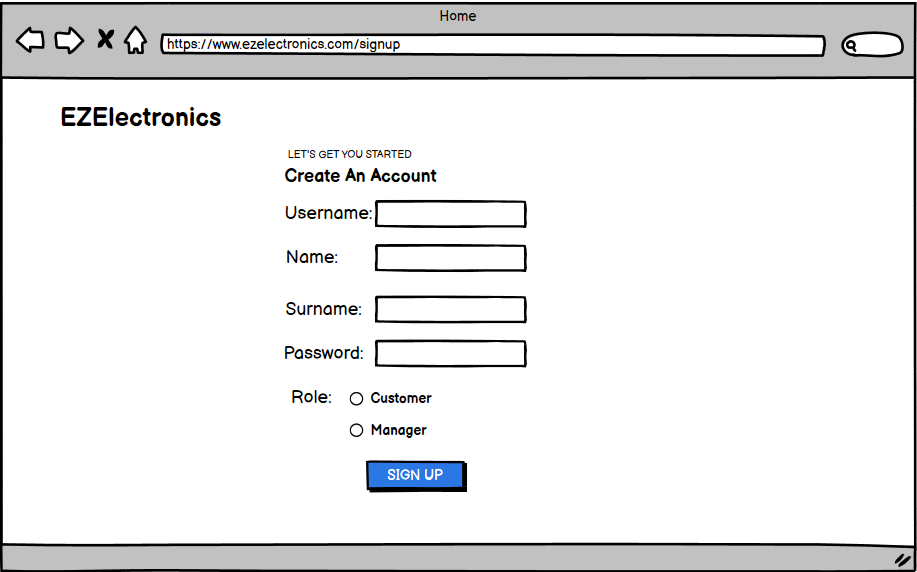
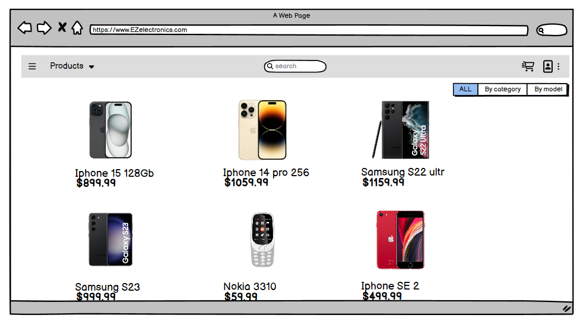
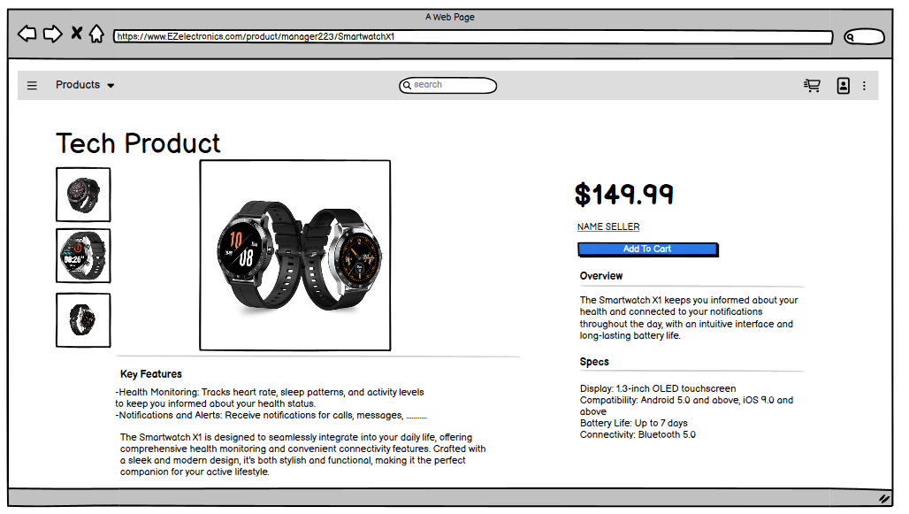
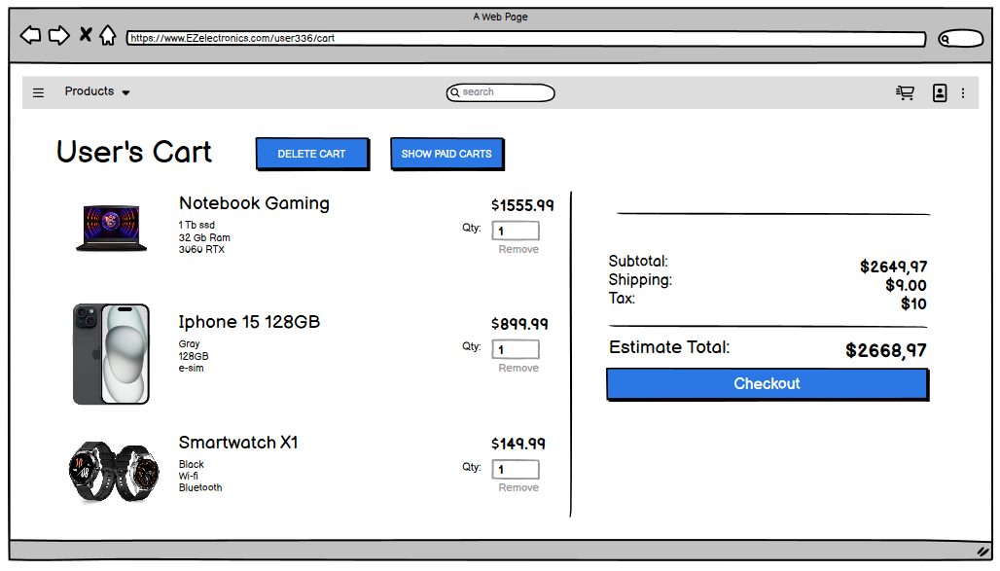
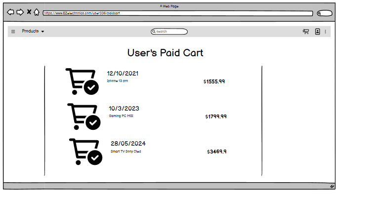
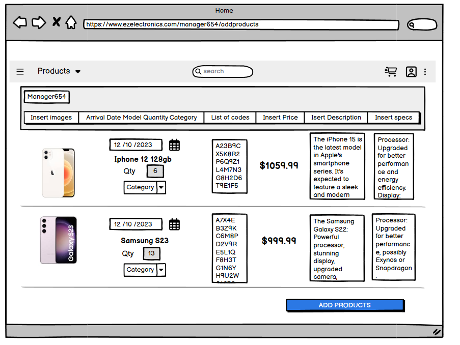
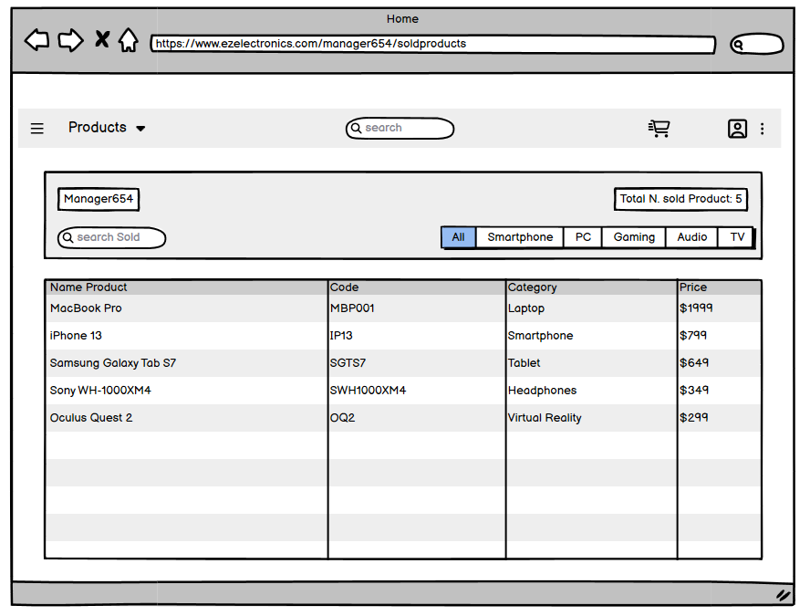
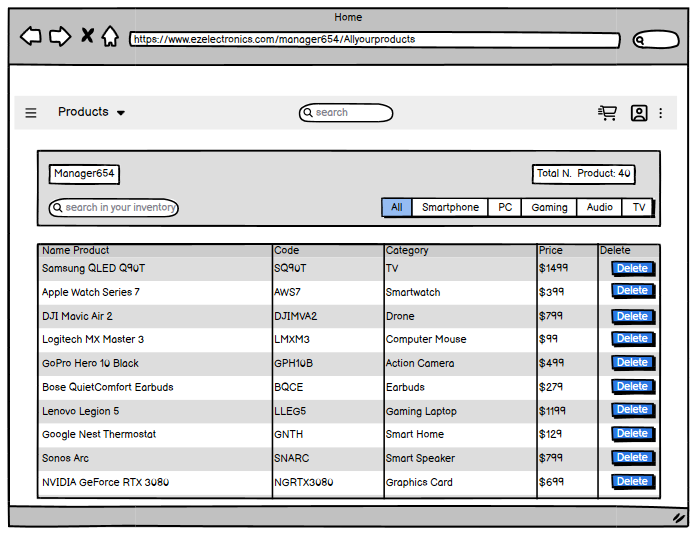

# Graphical User Interface Prototype - CURRENT

Authors:

Date:

Version:

\<Report here the GUI that you propose for EZElectronics in CURRENT form, as received by teachers. You are free to organize it as you prefer. A suggested presentation matches the Use cases and scenarios defined in the Requirement document. The GUI can be shown as a sequence of graphical files (jpg, png) >

----------------------------------LOGIN-----------------------------

----------------------------------CREATE ACCOUNT -----------------------------

----------------------------------USER LOGGED IN-----------------------------

------------HOME PRODUCTS PAGE----------

------------PRODUCT PAGE----------

------------CART----------

------------PAID CARTS----------

------------ADD PRODUCTS/SET----------

------------SOLD PRODUCT----------

------------SHOW MANAGER PRODUCTS----------

