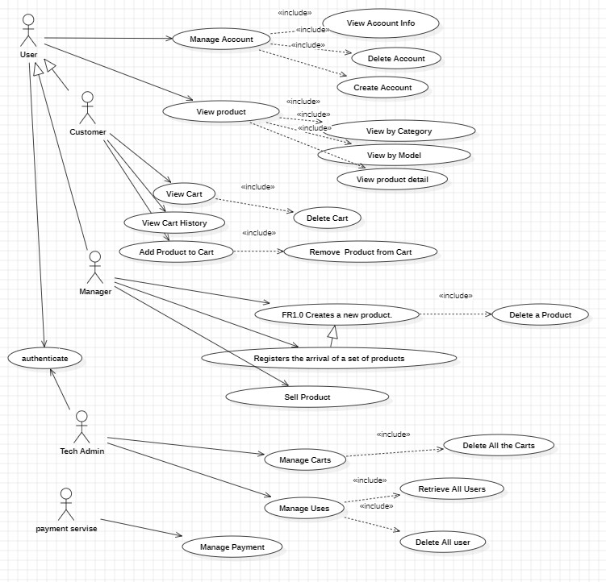
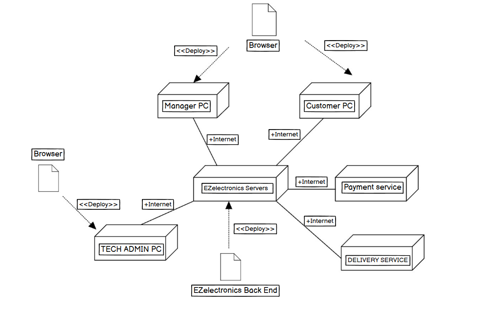

# Requirements Document - future EZElectronics

Date:

Version: V2 - description of EZElectronics in FUTURE form (as proposed by the team)

| Version number | Change |
| :------------: | :----: |
|      V2.0.1          |    Delete user usecase changes (should need authentication)    |

# Contents

- [Requirements Document - future EZElectronics](#requirements-document---future-ezelectronics)
- [Contents](#contents)
- [Informal description](#informal-description)
- [Stakeholders](#stakeholders)
- [Context Diagram and interfaces](#context-diagram-and-interfaces)
  - [Context Diagram](#context-diagram)
  - [Interfaces](#interfaces)
- [Stories and personas](#stories-and-personas)
- [Functional and non functional requirements](#functional-and-non-functional-requirements)
  - [Functional Requirements](#functional-requirements)
  - [Non Functional Requirements](#non-functional-requirements)
- [Use case diagram and use cases](#use-case-diagram-and-use-cases)
  - [Use case diagram](#use-case-diagram)
    - [Use case 1, UC1](#use-case-1-uc1)
      - [Scenario 1.1](#scenario-11)
      - [Scenario 1.2](#scenario-12)
      - [Scenario 1.x](#scenario-1x)
    - [Use case 2, UC2](#use-case-2-uc2)
    - [Use case x, UCx](#use-case-x-ucx)
- [Glossary](#glossary)
- [System Design](#system-design)
- [Deployment Diagram](#deployment-diagram)

# Informal description

EZElectronics (read EaSy Electronics) is a software application designed to help managers of electronics stores to manage their products and offer them to customers through a dedicated website. Managers can assess the available products, record new ones, and confirm purchases. Customers can see available products, add them to a cart and see the history of their past purchases.

# Stakeholders

| Stakeholder name | Description |
| :--------------: | :---------: |
| Customer  |       Users of Application who purchase product      |
| Manager, Premium Manager  |      Users of Application who sell product       |
| Start up Company  |    Developer of Software and Admins and CEO         |
| Product Company  |      The Company producing the Product       |
| Competitors  |       Competitor companies E.g. Ebay, Amazon retail, ...      |
| Payment Sevice   |       Online Payment service E.g. paypal      |
| Pick up points   |    Physical location for shipping and pickup with the help of delivery services.    |
| Delivery Services   |       The Service provieds delivery E.G. DHL    |

# Context Diagram and interfaces

## Context Diagram

## Interfaces

|   Actor   | Logical Interface | Physical Interface |
| :-------: | :---------------: | :----------------: |
| Users: Customer, Manager, Premium Manager |           PC        |       Web Page              |
| Tech Admin |         PC          |           Web Page         |
| Payment Service |       Internet Link           |       https://developer.paypal.com/api/rest/             |
| Data Base |      SQL           |      sqlite3              |
| Delivery Service |      Internet Link           |      https://developer.dhl.com/api-catalog              |

# Stories and personas
1.	Persona: Giulia - Electronics Store Manager
      
      •	Background: 
      1.	Giulia is the manager of a small electronics store. 
      2.	She's tech-savvy but lacks experience in managing online platforms.
      
      •	Story: 
      1.	Giulia needs a solution to streamline her store's operations and expand its reach online. She discovers EZElectronics and sees its potential to simplify inventory management and reach a wider customer base. 
      2.	She uses the platform to easily add new products, update stock levels, and fulfill online orders, ultimately boosting her store's revenue.

2.	Persona: Marco - Tech Customer

    •	Background: 
    1.	Marco is a college student with a passion for electronics. 
    2.	He frequently shops online for the latest gadgets and components.

    •	Story: 
    1.	Marco comes across EZElectronics while searching for a specific electronic component. Impressed by the website's user-friendly interface and diverse product range, he creates an account and starts browsing. He finds the component he needs, adds it to his cart, and completes the purchase hassle-free. 
    2.	Satisfied with his experience, Marco becomes a loyal customer, regularly checking EZElectronics for new arrivals.

3.	Persona: Tommaso - Tech Admin

    •	Background: 
    1.	Tommaso is the tech admin at EZElectronics, responsible for overseeing the development and maintenance of the software application. 
    2.	He has a strong passion for technology and innovation.
    
    •	Story: 
    1.	Tommaso is tasked with leading the development team in enhancing EZElectronics to meet the evolving needs of electronics store managers and customers. He conducts regular meetings to gather feedback from users and identifies areas for improvement. 
    2.	Tommaso works closely with the development team to implement new features and optimize the platform's performance. Through his expertise and dedication, Tommaso ensures that EZElectronics remains a top choice for electronics retailers seeking a reliable and user-friendly management solution.

4.	Persona: Matteo - Premium Manager

    •	Background: 
    1.	Matteo is the manager of a top-performing electronics store that partners with EZElectronics. 
    2.	He has opted for the premium manager package, which includes premium placement of his products on the website's top pages.
    
    •	Story: 
    1.	Matteo leverages his premium manager status on EZElectronics to ensure that his products receive maximum visibility on the platform. With his products featured prominently on the top pages of the website, Matteo attracts more customers and drives higher sales for his store.
    2.	He appreciates the additional exposure and marketing support provided by EZElectronics, which helps him stay ahead of the competition and grow his business.

# Functional and non functional requirements

## Functional Requirements

\<In the form DO SOMETHING, or VERB NOUN, describe high level capabilities of the system>

\<they match to high level use cases>

|  ID   | Description |
| :---: | :---------: |
|  FR1: Manage Products  |     • FR1.0 Create a new Product(ONLY MANAGER) / Delete a Product(ONLY MANAGER)/ Delete all Products(ONLY TECH ADMIN)   • FR1.1 Registers the arrival of Products of same model (ONLY MANAGER)     • FR1.2 Mark a product as sold    • FR1.3 Retrieve a product (All / with the same Category / Model)    • FR1.4 Registers the arrival of a set of products    • FR1.5 Mark a Product as sponssored (ONLY BY PREMIUM MANAGER)  • FR1.6 Unmark a Sponsored products (ONLY PREMIUM MANAGER) |
|  FR2: Manage Users  |   • FR2.0 Retrieves logged in user's Info.    • FR2.1 Retrieve a User (list of all users/ all users with a role (ONLY TECH ADMIN) / specific User with username)    •FR2.2 Create User / Delete User(USER AND TECH ADMIN) / Delete user with username  / Delete all the users (ONLY TECH ADMIN)    • FR2.4 Change the Account As Premium (ONLY BY MANAGER)|
|  FR3: Manage Cart  |      • FR3.0 Return the curent cart   • FR3.1 Add / Remove a product to cart     • FR3.2  Returns the history of the paid carts of the User   • FR3.3 Delete the cart of current user (ONLY BY CUSTOMER) /Delete all carts (ONLY TECH ADMIN) |
|  FR4: Manage Payment  |     • FR4.0 Choose a payment method  • FR4.1 Pay the current cart  • FR4.2 Pay the Premium Account  |
|  FR5: Authorization and Authentication  |       • FR5.0 Log in/Log out    • FR5.1 Password Recovery   |
|  FR6: Manage Shipping  |     • FR6.0 Choose a shipping method (Delivery Company)   • FR6.1 Show the shipping price   • FR6.2 Insert Address   • FR6.3 Track delivery |
|  FR7: Manage Whishlist  |      • FR7.0 Return the curent whislist   • FR7.1 Add / Remove a product to whislist (ONLY CUSTOMER) |

## Non Functional Requirements

\<Describe constraints on functional requirements>

|   ID    | Type (efficiency, reliability, ..) | Description | Refers to |
| :-----: | :--------------------------------: | :---------: | :-------: |
|  NFR1   |              Reliability                      |      • No more than one defect per user      |      All Functions     |
|  NFR2   |                 Usability                   |      •  Customer should be able to use Web app with no training less than 2 min.       |     FR3, FR4, FR5      |
|  NFR3   |                 Usability                   |      • Manager  should be able to use Web app with no training less than 5 min.       |     FR1, FR5      |
|  NFR4   |                 Efficiency                   |    • Website should be loaded in less than 2 sec   • execution of functions take less than 0.1 sec      |      All Functions     |
| NFR5 |               Portability                     |     • Web App  should be compatible with different browsers (Chrome, Edge, Safari, Mozila)    |     All Functions      |
| NFR6 |               Portability                     |     • Web App  should have different versrions for Devices (Desktop Version, Smartphone Version)     |     All Functions      |
| NFR7 |               Privacy                     |     • Customer data should not be used for commercial purposes in other companies and the purchase history should be available just for the Customer and the Company.     |     FR2, FR3      |
| NFR8 |               Security                     |     • The user information should be saved in data base in encrypted format and the payment portal shouold be safe   |     FR2, FR4, FR5      |

# Use case diagram and use cases

## Use case diagram

### Use case 1, View Account Info

| Actors Involved  |            Customer, Manager(Normal, Premium)               |
| :--------------: | :------------------------------------------------------------------: |
|   Precondition   | User has account and is Logged in (authenticated) |
|  Post condition  | User See his Account Information  |
| Nominal Scenario | 1.1 The Page Containting Customer info is shown    1.2 The Page Containting Normal Manager info is shown    1.3 The Page Containting Premium Manager info is shown    |
|     Variants     |                                  |
|    Exceptions    | 1.4 Error - There is no User with Provided information       |

##### Scenario 1.1

|  Scenario 1.1  |        The Page Containting Customer info is shown        |
| :------------: | :------------------------------------------------------------------------: |
|  Precondition  | User has account and is Logged in as Customer (authenticated) |
| Post condition |  Customer See his Account Information |
|     Step#      |            Description                   |
|       1        |   The Customer Clicks on the Account Info    |
|       2        |   FR2.0 Retrieves logged in user's Info. |
|       3        |    Customer See his Account Information.     |

##### Scenario 1.2

|  Scenario 1.2  |       The Page Containting Normal Manager info is shown        |
| :------------: | :------------------------------------------------------------------------: |
|  Precondition  | User has account and is Logged in as Normal Manager (authenticated) |
| Post condition |  Normal Manager See his Account Information |
|     Step#      |            Description                   |
|       1        |   The User Clicks on the Account Info    |
|       2        |   FR2.0 Retrieves logged in user's Info. |
|       3        |   Manager See his Account Information.   |

##### Scenario 1.3

|  Scenario 1.3  |       The Page Containting Premium Manager info is shown        |
| :------------: | :------------------------------------------------------------------------: |
|  Precondition  | User has account and is Logged in as Premium Manager (authenticated) |
| Post condition |  Premium Manager See his Account Information |
|     Step#      |            Description                   |
|       1        |   The User Clicks on the Account Info    |
|       2        |   FR2.0 Retrieves logged in user's Info. |
|       3        |   Premium Manager See his Account Information.   |

##### Scenario 1.4

|  Scenario 1.4  |  Error - There is no User with Provided information  |
| :------------: | :------------------------------------------------------------------------: |
|  Precondition  | User has account and is Logged in (authenticated) |
| Post condition |  User See a 404 Error - No User Found on the Web Page |
|     Step#      |            Description                   |
|       1        |   The User Clicks on the Account Info    |
|       2        |   FR2.0 Retrieves logged in user's Info. |
|       3        |    The dataBase returns Null             |
|       4        |    User see  404 Error message - No User Found on the Web Page   |

### Use case 2, Delete Account

| Actors Involved  |             Customer, Manager(Normal, Premium)               |
| :--------------: | :------------------------------------------------------------------: |
|   Precondition   | User has account and is Logged in (authenticated) |
|  Post condition  | User has been Deleted his Account  |
| Nominal Scenario |  2.1 User has been Deleted his Account (Normal / Premium)  |
|     Variants     |                                  |
|    Exceptions    |  2.2 Error - No Account has been found    |

##### Scenario 2.1

|  Scenario 2.1  |       User has been Deleted his Account        |
| :------------: | :------------------------------------------------------------------------: |
|  Precondition  | User has account and is Logged in (authenticated) |
| Post condition |  User has been Deleted his Account |
|     Step#      |            Description                   |
|       1        |  The User Clicks on the Delete Account button    |
|       2        |  FR2.0 Retrieve the Logged in User Info   |
|       3        |  FR4.0 Perform Log out   |
|       4        |  FR.2.1 Delete User     |
|       5        |  A message pops up that your account has been deleted       |
|       6        |  Redirect user to the home page       |

##### Scenario 2.2

|  Scenario 2.1  |       Error - No Account has been found         |
| :------------: | :------------------------------------------------------------------------: |
|  Precondition  | User has account and is Logged in (authenticated) |
| Post condition |  User has been faced an Error |
|     Step#      |            Description                   |
|       1        |  The User Clicks on the Delete Account button    |
|       2        |  FR2.0 Retrieve the Logged in User Info   |
|       3        |  DataBase Error - No account has been found |
|       5        |  Error is Pops up - No Account has been found   |

### Use case 3, Create Account

| Actors Involved  |             Customer, Manager               |
| :--------------: | :------------------------------------------------------------------: |
|   Precondition   | User has no account  |
|  Post condition  | User has been Created an Account  |
| Nominal Scenario |  3.1 User has been Created a Customer Account   3.2 User has been Created a Manager Account |
|     Variants     |                                  |
|    Exceptions    |  3.3 409 Error, user already exist in database    |

##### Scenario 3.1

|  Scenario 3.1  |       User has been Created a Customer Account        |
| :------------: | :------------------------------------------------------------------------: |
|  Precondition  | User has no account |
| Post condition |  User has been Created a Customer Account |
|     Step#      |            Description                    |
|       1        |  The User Clicks on the Create Account button    |
|       2        |  Enter the information as input and the role is Customer  |
|       3        |  FR2.1 Create User  |
|       4        |  A message pops up that your account has been created     |
|       5        |  Redirect user to the Login page       |

##### Scenario 3.2

|  Scenario 3.2  |       User has been Created a Manager Account        |
| :------------: | :------------------------------------------------------------------------: |
|  Precondition  | User has no account |
| Post condition |  User has been Created a Manager Account |
|     Step#      |            Description                   |
|       1        |  The User Clicks on the Create Account button    |
|       2        |  Enter the information as input and the role is Manager  |
|       3        |  FR2.1 Create User  |
|       4        |  A message pops up that your account has been created       |
|       5        |  Redirect user to the Login page       |

##### Scenario 3.3

|  Scenario 3.3  |       409 Error, user already exist in database        |
| :------------: | :------------------------------------------------------------------------: |
|  Precondition  | User has an account |
| Post condition |  409 Error, user already exist in database |
|     Step#      |            Description                   |
|       1        |  The User Clicks on the Create Account button    |
|       2        |  Enter the information as input and the role is Manager  |
|       2        |  FR2.1 Create User  |
|       3        |  database retrieves an error that the username is already exist  |
|       5        |  409 Error pops up: user already exist in database       |
|       6        |  Redirect user to the Login page       |

### Use case 4, View Product List

| Actors Involved  |             Customer, Manager               |
| :--------------: | :------------------------------------------------------------------: |
|   Precondition   | User has an account and Logged in (Authenticated) |
|  Post condition  | User see the result as list of products   |
| Nominal Scenario |  4.1 User Views the product list based on Model  - Sponsored product on Top   4.2 User Views the product list based on Category - Sponsored product on Top  |
|     Variants     |  4.3 User Views the product list without Sponsored product on Top        |
|    Exceptions    |  4.4 No Product Found based on the criteria    |

##### Scenario 4.1

|  Scenario 4.1  |       User Views the product list based on Model - Sponsored product on Top      |
| :------------: | :------------------------------------------------------------------------: |
|  Precondition  | User has an account and Logged in (Authenticated) |
| Post condition |  User Views the product list based on Model |
|     Step#      |            Description                   |
|       1        |  The User Clicks on the View by Model button    |
|       2        |  FR1.3 Retrieve product list with same model  |
|       3        |  the list of products with same model show up in the web page  |

##### Scenario 4.2

|  Scenario 4.2  |       User Views the product list based on Category - Sponsored product on Top     |
| :------------: | :------------------------------------------------------------------------: |
|  Precondition  | User has an account and Logged in (Authenticated) |
| Post condition |  User Views the product list based on Category |
|     Step#      |            Description                   |
|       1        |  The User Clicks on the View by Category button    |
|       2        |  FR1.3 Retrieve product list with same Category  |
|       3        |  the list of products with same Category show up in the web page  |

##### Scenario 4.3

|  Scenario 4.3  |       User Views the product list without Sponsored product on Top       |
| :------------: | :------------------------------------------------------------------------: |
|  Precondition  | User has an account and Logged in (Authenticated) |
| Post condition |  User Views the product list based on Catagory/Model without Sponsored product on Top |
|     Step#      |            Description                   |
|       1        |  The User Clicks on the View by Category/Model button    |
|       2        |  FR1.3 Retrieve product list with same Category/Model  |
|       3        |  Database Retrieves the list  |
|       4        |  The list of products with same Category/Model show up in the web page  |

##### Scenario 4.4

|  Scenario 4.4  |       No Product Found based on the criteria       |
| :------------: | :------------------------------------------------------------------------: |
|  Precondition  | User has an account and Logged in (Authenticated) |
| Post condition |  No Product Found based on the criteria |
|     Step#      |            Description                   |
|       1        |  The User Clicks on the View by Category button    |
|       2        |  FR1.3 Retrieve product list with same Category  |
|       3        |  Database Retrieves: Null  |
|       4        |  This message pops up: No Product Found based on the criteria  |

### Use case 5, View Product details

| Actors Involved  |             Customer, Manager               |
| :--------------: | :------------------------------------------------------------------: |
|   Precondition   | User has an account and Logged in (Authenticated) |
|  Post condition  | User see the details of product including the image and description   |
| Nominal Scenario |  5.1 User Views the product details (is not sponsored)   5.2 User Views the sponsored product details |
|     Variants     |          |
|    Exceptions    |  5.3 404 Error - The Product Found    |

##### Scenario 5.1

|  Scenario 5.1  |       User Views the product details (is not sponsored)      |
| :------------: | :------------------------------------------------------------------------: |
|  Precondition  | User has an account and Logged in (Authenticated) |
| Post condition |  User see the details of product (is not sponsored) including the image and description |
|     Step#      |            Description                   |
|       1        |  The User Clicks on a normal Product   |
|       2        |  FR1.3 Retrieve a product  |
|       3        |  DataBase Retrieves the details of a normal product  |
|       4        |  The Detail of the normal product are shown to the user   |

##### Scenario 5.2

|  Scenario 5.2  |       User Views the sponsored product details     |
| :------------: | :------------------------------------------------------------------------: |
|  Precondition  | User has an account and Logged in (Authenticated) |
| Post condition |  User see the details of Sponsored product including the image and description |
|     Step#      |            Description                   |
|       1        |  The User Clicks on a Sponsored Product    |
|       2        |  FR1.3 Retrieve a product  |
|       3        | DataBase Retrieves the details of an Sponsored product  |
|       4        |  The Detail of the sposnsored product are shown to the user   |

##### Scenario 5.3

|  Scenario 5.3  |       404 Error - The Product Found        |
| :------------: | :------------------------------------------------------------------------: |
|  Precondition  | User has an account and Logged in (Authenticated) |
| Post condition |  User Encounters an Error - THe Product Found |
|     Step#      |            Description                   |
|       1        |  The User Clicks on a product    |
|       2        |  FR1.3 Retrieve a product  |
|       3        |  Database Reruens an Error  |
|       4        |  This error msg pops up: 404 Error - The Product Found  |

### Use case 6, View Cart 

| Actors Involved  |             Customer               |
| :--------------: | :------------------------------------------------------------------: |
|   Precondition   | User has an account and Logged in as Customer (Authenticated) |
|  Post condition  | Customer view the Details of the cart   |
| Nominal Scenario |  6.1 Customer can view the details of his cart |
|     Variants     |                                  |
|    Exceptions    |  6.2 No Product in the cart.    |

##### Scenario 6.1

|  Scenario 6.1  |       Customer view the Details of the cart       |
| :------------: | :------------------------------------------------------------------------: |
|  Precondition  | User has an account and Logged in as Customer (Authenticated) |
| Post condition |  Customer view the Details of the cart |
|     Step#      |            Description                   |
|       1        |  The Customer Clicks on the View Cart button    |
|       2        |  FR3.0 Return the curent cart |
|       3        |  The Cart details will be Displayed on the web page |

##### Scenario 6.2

|  Scenario 6.2  |       No Product in the Cart       |
| :------------: | :------------------------------------------------------------------------: |
|  Precondition  | User has an account and Logged in as Customer (Authenticated) |
| Post condition |  Customer see No Product has been added to cart Message. |
|     Step#      |            Description                   |
|       1        |  The Customer Clicks on the View Cart button    |
|       2        | FR3.0 Return the curent cart |
|       3        |  DataBase returns NULL |
|       3        |  "No Product has been added to the cart. Keep Shopping.." will pops up. |

### Use case 7, View Cart History

| Actors Involved  |             Customer               |
| :--------------: | :------------------------------------------------------------------: |
|   Precondition   | User has an account and Logged in as Customer (Authenticated) |
|  Post condition  | Customer view the history of cart   |
| Nominal Scenario |  7.1 Customer can view the history of his cart |
|     Variants     |                                  |
|    Exceptions    |  7.2 No history for cart is available    |

##### Scenario 7.1

|  Scenario 7.1  |       Customer can view the history of his cart       |
| :------------: | :------------------------------------------------------------------------: |
|  Precondition  | User has an account and Logged in as Customer (Authenticated) |
| Post condition |  Customer can view the history of his cart |
|     Step#      |            Description                   |
|       1        |  The Customer Clicks on the View Cart History button    |
|       2        |  FR3.2 Return History of the paid carts of the user |
|       3        |  The list will be Displayed on the web page |

##### Scenario 7.2

|  Scenario 7.2  |       No history for cart is available       |
| :------------: | :------------------------------------------------------------------------: |
|  Precondition  | User has an account and Logged in as Customer (Authenticated) |
| Post condition |  Error Message: No Cart History Available |
|     Step#      |            Description                   |
|       1        |  The Customer Clicks on the View Cart History button    |
|       2        |  FR3.2 Return History of the paid carts of the user |
|       3        |  DataBase returns NULL |
|       3        |  No Cart History Message will be desplayed to the Customer |

### Use case 8, Add Product to the Cart

| Actors Involved  |             Customer               |
| :--------------: | :------------------------------------------------------------------: |
|   Precondition   | User has an account and Logged in as Customer (Authenticated) |
|  Post condition  | The cart contains the product   |
| Nominal Scenario |  8.1 Customer successfully add normal product to his cart   8.2 Customer successfully add sponsored product to his cart|
|     Variants     |  8.3 Customer add n product to his cart   |
|    Exceptions    |  8.4 The product is sold out or unavailable    |

##### Scenario 8.1

|  Scenario 8.1  |       Customer adds a normal product to his cart       |
| :------------: | :------------------------------------------------------------------------: |
|  Precondition  | User has an account and Logged in as Customer (Authenticated) |
| Post condition |  The cart contains the normal product |
|     Step#      |            Description                   |
|       1        |  The Customer Clicks on Add Product button    |
|       2        |  FR3.1 Add product to the current cart |
|       3        |  The cart contains the product |
|       4        |  if Customer clicks on "Show Cart" FR3.0 Return current cart|

##### Scenario 8.2

|  Scenario 8.2  |      Customer adds a sponsored product to his cart       |
| :------------: | :------------------------------------------------------------------------: |
|  Precondition  | User has an account and Logged in as Customer (Authenticated) |
| Post condition |  The cart contains the sponsored product |
|     Step#      |            Description                   |
|       1        |  The Customer Clicks on Add Product button    |
|       2        |  FR3.1 Add product to the current cart |
|       3        |  The cart contains the product |
|       4        |  if Customer clicks on "Show Cart" FR3.0 Return current cart|

##### Scenario 8.3

|  Scenario 8.3  |      Customer add n product to his cart       |
| :------------: | :------------------------------------------------------------------------: |
|  Precondition  | User has an account and Logged in as Customer (Authenticated) |
| Post condition |  The cart contains n product |
|     Step#      |            Description                   |
|       1        |  The Customer selects n number of products    |
|       2        |  The Customer Clicks on Add Product button  |
|       3        |  n * FR3.1 Add product to the current cart |
|       4        |   if Customer clicks on "Show Cart" FR3.0 Return current cart  |

##### Scenario 8.4

|  Scenario 8.4  |      The product is sold out or unavailable       |
| :------------: | :------------------------------------------------------------------------: |
|  Precondition  | User has an account and Logged in as Customer (Authenticated) |
| Post condition | This msg Pops up: The product is sold out or unavailable |
|     Step#      |            Description                   |
|       1        |  The Customer Clicks on Add Product button  |
|       2        |  FR3.1 Add product to the current cart |
|       3        |  DataBase return an Error  |
|       4        |  This msg Pops up: The product is sold out or unavailable |

### Use case 9, Delete Cart

| Actors Involved  |             Customer               |
| :--------------: | :------------------------------------------------------------------: |
|   Precondition   | User has an account and Logged in as Customer and it has at least one product in Cart  |
|  Post condition  | The cart has been deleted   |
| Nominal Scenario |  9.1 Customer successfully deleted his cart |
|     Variants     |    |
|    Exceptions    |  9.2 There is no product in the cart    |

##### Scenario 9.1

|  Scenario 9.1  |       Customer successfully deleted his cart       |
| :------------: | :------------------------------------------------------------------------: |
|  Precondition  | User has an account and Logged in as Customer and it has at least one product in Cart  |
| Post condition |  The cart has been deleted |
|     Step#      |            Description                   |
|       1        |  The Customer Clicks on Delete Cart button    |
|       2        |  FR3.3 Delete current cart of the current cart |
|       3        |  Database successfully deletes the records related to the Cart |
|       4        |  "you Deleted your cart successfully" msg pops up |
|       5        |  Navigate customer to Home Page |

##### Scenario 9.2

|  Scenario 9.2  |      There is no product in the cart       |
| :------------: | :------------------------------------------------------------------------: |
|  Precondition  | User has an account and Logged in as Customer (Authenticated) |
| Post condition |  There is no product in the cart and nothing changed |
|     Step#      |            Description                   |
|       1        |  The Customer Clicks on Delete Cart button    |
|       2        |  FR3.3 Delete current cart of the current cart |
|       3        |  Database Returns an error |
|       4        |  "You do not have any cart" msg pops up |
|       5        |  Navigate customer to Home Page |

### Use case 10, Remove Product from the Cart

| Actors Involved  |             Customer               |
| :--------------: | :------------------------------------------------------------------: |
|   Precondition   | User has an account and Logged in as Customer and it has at least one product in Cart |
|  Post condition  | The product is Removed from the cart   |
| Nominal Scenario |  10.1 The product is Successfully Removed from the cart |
|     Variants     |     |
|    Exceptions    |  10.2 The product does not exist in cart - 404 Error   |

##### Scenario 10.1

|  Scenario 10.1  |       The product is Removed from the cart       |
| :------------: | :------------------------------------------------------------------------: |
|  Precondition  | User has an account and Logged in as Customer and it has at least one product in Cart  |
| Post condition |  The product is Removed from the cart |
|     Step#      |            Description                   |
|       1        |  The Customer Clicks on Remove Product button    |
|       2        |  FR3.1 Remove the product from the current cart |
|       3        |  if Customer clicks on "Show Cart" FR3.0 Return current cart|

##### Scenario 10.2

|  Scenario 10.2  |      The product does not exist in cart - 404 Error       |
| :------------: | :------------------------------------------------------------------------: |
|  Precondition  | User has an account and Logged in as Customer and it has at least one product in Cart  |
| Post condition |  The product does not exist in cart and nothing changed |
|     Step#      |            Description                   |
|       1        |  The Customer Clicks on Remove Product button  |
|       2        |  FR3.1 Remove the product from the current cart |
|       3        |  Database Returns an Error  |
|       4        |  "The product does not exist in cart - 404 Error"  Message Pops up  |

### Use case 11, Delete a Product

| Actors Involved  |             Manager, Premium Manager               |
| :--------------: | :------------------------------------------------------------------: |
|   Precondition   | User has an account and Logged in as Manager (Authenticated) |
|  Post condition  | The product is Deleted from the Inventory   |
| Nominal Scenario |  11.1 Manager successfully Deletes the product from the Inventory   11.2 Premium Manager successfully Deletes the Sponsored product from the Inventory |
|     Variants     |    |
|    Exceptions    |  11.3 The product does not represent a product in our database - 404 Error    |

##### Scenario 11.1

|  Scenario 11.1  |       Manager successfully Deletes the product from the Inventory       |
| :------------: | :------------------------------------------------------------------------: |
|  Precondition  | User has an account and Logged in as Manager (Authenticated) |
| Post condition |  The product is Deleted from the Inventory |
|     Step#      |            Description                   |
|       1        |   The Manager Selects the product to be deleted   |
|       2        |   The Manager Clicks on Delete the Product  button  |
|       3        |  FR1.0 Delete a product |
|       4        |  Delete the Product from the DataBase |
|       5        |  DataBase Returns successfull result |
|       6        |  "The product has been Deleted" msg pops up|

##### Scenario 11.2

|  Scenario 11.2  |       Premium Manager successfully Deletes the product from the Inventory       |
| :------------: | :------------------------------------------------------------------------: |
|  Precondition  | User has an account and Logged in as Premium Manager (Authenticated) |
| Post condition |  The Sponsored product is Deleted from the Inventory |
|     Step#      |            Description                   |
|       1        |   The Manager Selects the Sponsored product to be deleted   |
|       2        |   The Manager Clicks on Delete the Product  button  |
|       3        |  FR1.0 Delete a product |
|       4        |  Delete the Product from the DataBase |
|       5        |  DataBase Returns successfull result |
|       6        |  "The Sponsored product has been Deleted" msg pops up|

##### Scenario 11.3
|  Scenario 11.3  |      The product does not represent a product in our database       |
| :------------: | :------------------------------------------------------------------------: |
|  Precondition  | User has an account and Logged in as Manager (Authenticated) |
| Post condition |  The product does not represent a product in our database - 404 Error |
|     Step#      |            Description                   |
|       1        |   The Manager Selects the product to be deleted   |
|       2        |   The Manager enters the product ID  |
|       3        |  FR1.0 Delete a product |
|       4        |  Delete the Product from the DataBase |
|       5        |  DataBase Returns Error - Does not represent a record in Database |
|       6        |  "There is no such a Product" msg pops up|

### Use case 12, Registers the arrival of a set of products

| Actors Involved  |             Manager               |
| :--------------: | :------------------------------------------------------------------: |
|   Precondition   | User has an account and Logged in as Manager (Authenticated) |
|  Post condition  | All the products are added to the inventory   |
| Nominal Scenario |  12.1 Manager successfully added All the products to the inventory |
|     Variants     |    |
|    Exceptions    |  12.2 The product is already registered in our database    12.3 The ArrivalDate is invalid   |

##### Scenario 12.1

|  Scenario 12.1  |       Manager successfully added All the products to the inventory        |
| :------------: | :------------------------------------------------------------------------: |
|  Precondition  | User has an account and Logged in as Manager (Authenticated) |
| Post condition |  All the products are added to the inventory |
|     Step#      |            Description                   |
|       1        |   The Manager selects Register a set of arrivals   |
|       2        |   The Manager inserts the information of them  |
|       3        |  FR1.4 Register the arrival of set of products |
|       4        |  Insert data to the DataBase |
|       5        |  DataBase Returns successfull result |
|       6        |  "The products successfully have been Registered" msg pops up|

##### Scenario 12.2

|  Scenario 12.2  |       The product is already registered in our database        |
| :------------: | :------------------------------------------------------------------------: |
|  Precondition  | User has an account and Logged in as Manager (Authenticated) |
| Post condition |  The product is already in our database - Error |
|     Step#      |            Description                   |
|       1        |   The Manager selects Register a set of arrivals   |
|       2        |   The Manager inserts the information of them  |
|       3        |  FR1.4 Register the arrival of set of products |
|       4        |  Insert data to the DataBase |
|       5        |  DataBase Returns Error - Duplicate Data |
|       6        |  "Error: The products have not been Registered - Already in our Database " msg pops up|

##### Scenario 12.3

|  Scenario 12.3  |       The ArrivalDate is invalid         |
| :------------: | :------------------------------------------------------------------------: |
|  Precondition  | User has an account and Logged in as Manager (Authenticated) |
| Post condition |  The ArrivalDate is invalid - Error |
|     Step#      |            Description                   |
|       1        |   The Manager selects Register a set of arrivals   |
|       2        |   The Manager inserts the information of them  |
|       3        |  FR1.4 Register the arrival of set of products |
|       4        |  if (The Arrival date is after current date) == True |
|       5        |  "Error: The products have not been Registered due to the invalid ArrivalDate" msg pops up|

### Use case 13, Sell Product

| Actors Involved  |             Manager, Premium Manager, Customer               |
| :--------------: | :------------------------------------------------------------------: |
|   Precondition   | User has an account and Logged in as Manager (Authenticated) |
|  Post condition  | The product marked as sold in the system  |
| Nominal Scenario |  13.1 Manager successfully sold an Item   13.2 Premium Manager successfully sold an Sponsored Item  |
|     Variants     |    |
|    Exceptions    |  13.2 404 Error - The product ID does not represent a product in database    13.3 Error - The product has already been sold     13.4 Error - SellingDate is after the current date    13.5 Error - SellingDate is before the product's arrivalDate  |

##### Scenario 13.1

|  Scenario 13.1  |       Manager successfully sold an Item of his Inventory        |
| :------------: | :------------------------------------------------------------------------: |
|  Precondition  | User has an account and Logged in as Manager (Authenticated) |
| Post condition |  The product marked as sold in the system and the  |
|     Step#      |            Description                   |
|       1        |   ProductID is recieved from Customer which wants to buy   |
|       2        |  check the productId exist in database == True  |
|       3        |  check the product has been sold out == False |
|       4        |  Check the SellingDate is after the current date == False |
|       5        |  SellingDate is before the product's arrivalDate == False |
|       6        |  FR1.2 Mark the product as sold |
|       7        |  Update the inventory |

##### Scenario 13.2

|  Scenario 13.2  |       Premium Manager successfully sold an Sponsored Item         |
| :------------: | :------------------------------------------------------------------------: |
|  Precondition  | User has an account and Logged in as Premium Manager (Authenticated) |
| Post condition |  The Sponsored product marked as sold in the system and the  |
|     Step#      |            Description                   |
|       1        |   ProductID is recieved from Customer which wants to buy   |
|       2        |  check the productId exist in database == True  |
|       3        |  check the product has been sold out == False |
|       4        |  Check the SellingDate is after the current date == False |
|       5        |  SellingDate is before the product's arrivalDate == False |
|       6        |  FR1.2 Mark the product as sold |
|       7        |  Update the inventory |

##### Scenario 13.3

|  Scenario 13.3  |       404 Error - The product ID does not represent a product in database        |
| :------------: | :------------------------------------------------------------------------: |
|  Precondition  | User has an account and Logged in as Manager (Authenticated) |
| Post condition | 404 Error - The product ID does not represent a product in database  |
|     Step#      |            Description                   |
|       1        |   ProductID is recieved from Customer which wants to buy   |
|       2        |  check the productId exist in database == False  |
|       3        |  404 Error message pops up "The product ID does not represent a product in database" |

##### Scenario 13.4

|  Scenario 13.4  |       Error - The product has already been sold        |
| :------------: | :------------------------------------------------------------------------: |
|  Precondition  | User has an account and Logged in as Manager (Authenticated) |
| Post condition |  Error - The product has already been sold  |
|     Step#      |            Description                   |
|       1        |   ProductID is recieved from Customer which wants to buy   |
|       2        |  check the product has been sold out == True |
|        3       |  Error messag pops up: "The product has already been sold out" |

##### Scenario 13.5

|  Scenario 13.5  |       Error - SellingDate is after the current date        |
| :------------: | :------------------------------------------------------------------------: |
|  Precondition  | User has an account and Logged in as Manager (Authenticated) |
| Post condition |  The product marked as sold in the system and the  |
|     Step#      |            Description                   |
|       1        |   ProductID is recieved from Customer which wants to buy   |
|       2        |  Check the SellingDate is after the current date == True |
|       3        |  Error message pops up: "SellingDate is after the current date" |

##### Scenario 13.6

|  Scenario 13.6  |      Error - SellingDate is before the product's arrivalDate        |
| :------------: | :------------------------------------------------------------------------: |
|  Precondition  | User has an account and Logged in as Manager (Authenticated) |
| Post condition |  The product marked as sold in the system and the  |
|     Step#      |            Description                   |
|       1        |   ProductID is recieved from Customer which wants to buy   |
|       2        |  SellingDate is before the product's arrivalDate == True |
|       3        |  error message pops up: "SellingDate is before the product's arrivalDate" |

### Use case 14, Create a new Product

| Actors Involved  |             Manager               |
| :--------------: | :------------------------------------------------------------------: |
|   Precondition   | User has an account and Logged in as Manager (Authenticated) |
|  Post condition  | The product is added to the Inventory   |
| Nominal Scenario |  14.1 Manager successfully add product to the Inventory |
|     Variants     |    |
|    Exceptions    |  14.2 The product is already exist in the database - 409 Error   14.3 The arrivalDate of the product is after the current date    |

##### Scenario 14.1

|  Scenario 14.1  |       Manager add a product to his cart       |
| :------------: | :------------------------------------------------------------------------: |
|  Precondition  | User has an account and Logged in as Manager (Authenticated) |
| Post condition |  The product is added to the Inventory |
|     Step#      |            Description                   |
|       1        |  The Manager Clicks on Add a new Product  button    |
|       2        |  The Manager enters the information of the product    |
|       3        |  FR1.0 Create a new product |
|       4        |  Insert the Product in DataBase |
|       5        |  DataBase Returns success |
|       6        |  "The product has been added" msg pops up and manager can see the new product in his product list|

##### Scenario 14.2
|  Scenario 14.2  |      The product is already exist in the database - 409 Error       |
| :------------: | :------------------------------------------------------------------------: |
|  Precondition  | User has an account and Logged in as Manager (Authenticated) |
| Post condition |  The product is already exist in the database - 409 Error |
|     Step#      |            Description                   |
|       1        |  The Manager Clicks on Add a new Product  button    |
|       2        |  The Manager enters the information of the product    |
|       3        |  FR1.0 Create a new product |
|       4        |  Insert the Product in DataBase |
|       5        |  DataBase Returns error - "Duplicated product ID" |
|       6        |  "The product is already exist in our DataBase" msg pops up|

##### Scenario 14.3

|  Scenario 14.2  |      Manager Inserts an invalid arrival Date - 409 Error       |
| :------------: | :------------------------------------------------------------------------: |
|  Precondition  | User has an account and Logged in as Manager (Authenticated) |
| Post condition |   The arrivalDate of the product is after the current date - 409 Error |
|     Step#      |            Description                   |
|       1        |  The Manager Clicks on Add a new Product  button    |
|       2        |  The Manager enters the information of the product    |
|       3        |  The Manager inserts the arrival date manually    |
|       4        |  FR1.4 Register the Arrival of a set of product |
|       3        |  FR1.0 Create a new product |
|       4        |  Insert the Product in DataBase |
|       5        |  we check Arrival date which manager entered is after the current date = True  |
|       6        |  "The arrivalDate of the product is after the current date - 409 Error" msg pops up|

### Use case 15, Mark a Product as Sponsored

| Actors Involved  |            Premium Manager               |
| :--------------: | :------------------------------------------------------------------: |
|   Precondition   | User has an account and Logged in as Premium Manager (Authenticated) |
|  Post condition  | The product is marked as Sponsored product   |
| Nominal Scenario |  15.1 The Premium Manager successfully marks thr product as sponsored |
|     Variants     |    |
|    Exceptions    |  15.2 The product is already is an sponsored product    15.3 The manager is not a premium manager    |

##### Scenario 15.1

|  Scenario 15.1  |       The Premium Manager marks the product as sponsored       |
| :------------: | :------------------------------------------------------------------------: |
|  Precondition  | User has an account and Logged in as Premium Manager (Authenticated) |
| Post condition |  The Premium Manager successfully marks the product as sponsored |
|     Step#      |            Description                   |
|       1        |  The Manager Clicks on mark the Product as sponsored button    |
|       2        |  Check if the Manager is Premium == True |
|       3        |  Check if the product is sponsored == False |
|       4        |  Mark the Sponsored feature in DB as True |
|       5        |  The premium manager can see the product marked as sponsored |

##### Scenario 15.2

|  Scenario 15.2  |        The product is already is an sponsored product       |
| :------------: | :------------------------------------------------------------------------: |
|  Precondition  | User has an account and Logged in as Premium Manager (Authenticated) |
| Post condition |  The Premium Manager see an Error: Already Sponsored product |
|     Step#      |            Description                   |
|       1        |  The Manager Clicks on mark the Product as sponsored button    |
|       2        |  Check if the Manager is Premium == True |
|       3        |  Check if the product is sponsored == Ture |
|       4        |  The premium manager see This Error: "Product is already sponsored" |

##### Scenario 15.3

|  Scenario 15.3  |       The manager is not a premium manager       |
| :------------: | :------------------------------------------------------------------------: |
|  Precondition  | User has an account and Logged in as Premium Manager (Authenticated) |
| Post condition |  The Premium Manager encounters with this erro: You are not a Premium Manager!!! |
|     Step#      |            Description                   |
|       1        |  The Manager Clicks on mark the Product as sponsored button    |
|       2        |  Check if the Manager is Premium == False |
|       3        |  Error: You are not a Premium Manager!!! |

### Use case 16, Unmark a Product as Sponsored

| Actors Involved  |            Premium Manager               |
| :--------------: | :------------------------------------------------------------------: |
|   Precondition   | User has an account and Logged in as Premium Manager (Authenticated) |
|  Post condition  | The sponsored product is unmarked    |
| Nominal Scenario |  16.1 The Premium Manager successfully unmarks the sponsored product  |
|     Variants     |    |
|    Exceptions    |  16.2 The product is already is not a sponsored product    16.3 The manager is not a premium manager    |

##### Scenario 16.1

|  Scenario 16.1  |       The Premium Manager successfully unmarks the sponsored product      |
| :------------: | :------------------------------------------------------------------------: |
|  Precondition  | User has an account and Logged in as Premium Manager (Authenticated) |
| Post condition |  The sponsored product is unmarked |
|     Step#      |            Description                   |
|       1        |  The Manager Clicks on Unmark the Product    |
|       2        |  Check if the Manager is Premium == True |
|       3        |  Check if the product is sponsored == True |
|       4        |  UnMark the Sponsored feature in DB as True |
|       5        |  The premium manager can see the sponsored product Unmarked  |

##### Scenario 16.2

|  Scenario 16.2  |        The product is already is not a sponsored product       |
| :------------: | :------------------------------------------------------------------------: |
|  Precondition  | User has an account and Logged in as Premium Manager (Authenticated) |
| Post condition |  The Premium Manager see an Error: Not Sponsored product |
|     Step#      |            Description                   |
|       1        |  The Manager Clicks on mark the Product     |
|       2        |  Check if the Manager is Premium == True |
|       3        |  Check if the product is sponsored == False |
|       4        |  The premium manager see This Error: "Product is not a sponsored Product" |

##### Scenario 16.3

|  Scenario 16.3  |       The manager is not a premium manager       |
| :------------: | :------------------------------------------------------------------------: |
|  Precondition  | User has an account and Logged in as Premium Manager (Authenticated) |
| Post condition |  The Premium Manager encounters with this erro: You are not a Premium Manager!!! |
|     Step#      |            Description                   |
|       1        |  The Manager Clicks on mark the Product     |
|       2        |  Check if the Manager is Premium == False |
|       3        |  Error: You are not a Premium Manager!!! |

### Use case 17, Delete All The Carts

| Actors Involved  |            Tech Admin               |
| :--------------: | :------------------------------------------------------------------: |
|   Precondition   |The Tech Admin is authenticated and has access to the admin panel|
|  Post condition  | All Carts are deleted    |
| Nominal Scenario |  17.1 The Tech Admin successfully deletes all carts  |
|     Variants     |    |
|    Exceptions    |  17.2 All Carts are already deleted (NO CART IN DATABASE ) |

##### Scenario 17.1

|  Scenario 17.1  |       The Tech Admin successfully deletes all carts       |
| :------------: | :------------------------------------------------------------------------: |
|   Precondition   | The Tech Admin is authenticated and has access to the admin panel |
|  Post condition  | All Carts are deleted    Users are notified of the deletion of their carts  |
|     Step#      |            Description                   |
|       1        |  The Tech Admin  Clicks on Delete ALL carts |
|       2        |  Check if there is at least one cart == True |
|       3        |  The Tech Admin  Clicks on confirm to delete |
|       4        |  The Tech Admin can see the success of the operation  |
|       5        |  Users are notified of the deletion of their carts  |
##### Scenario 17.2

|  Scenario 17.1  |       The Tech Admin successfully deletes all carts       |
| :------------: | :------------------------------------------------------------------------: |
|   Precondition   | The Tech Admin is authenticated and has access to the admin panel|
|  Post condition  | All Carts are deleted    |
|     Step#      |            Description                   |
|       1        |  The Tech Admin  Clicks on Delete ALL carts |
|       2        |  Check if there is at least one cart == False |
|       3        |  The Tech Admin see This Error: "ERROR: No Cart exist" |

### Use case 18, Delete All The Carts

| Actors Involved  |            Tech Admin               |
| :--------------: | :------------------------------------------------------------------: |
|   Precondition   |The Tech Admin is authenticated and has access to the admin panel|
|  Post condition  | All users are deleted    |
| Nominal Scenario |  17.1 The Tech Admin successfully deletes all users  |
|     Variants     |    |
|    Exceptions    |  17.2 All Users are already deleted (NO user IN DATABASE ) |

##### Scenario 18.1

|  Scenario 18.1  |       The Tech Admin successfully deletes all users       |
| :------------: | :------------------------------------------------------------------------: |
|   Precondition   | The Tech Admin is authenticated and has access to the admin panel |
|  Post condition  | All Carts are deleted    Users are notified of the deletion of their accounts  |
|     Step#      |            Description                   |
|       1        |  The Tech Admin  Clicks on Delete ALL carts |
|       2        |  Check if there is at least one user == True |
|       3        |  The Tech Admin  Clicks on confirm to delete |
|       4        |  The Tech Admin can see the success of the operation  |
|       5        |  Users are notified of the deletion of their account  |
##### Scenario 18.2

|  Scenario 18.2  |       The Tech Admin successfully deletes all users       |
| :------------: | :------------------------------------------------------------------------: |
|   Precondition   | The Tech Admin is authenticated and has access to the admin panel|
|  Post condition  | All USERS are deleted    |
|     Step#      |            Description                   |
|       1        |  The Tech Admin  Clicks on Delete ALL users |
|       2        |  Check if there is at least one user == False |
|       3        |  The Tech Admin see This Error: "ERROR: No USER exist" |

### Use case 19, Manage Payment

| Actors Involved  |            Payment Services, Customers, Managers              |
| :--------------: | :------------------------------------------------------------------: |
|   Precondition   | The customer has items in their online shopping cart. |
|  Post condition  | The customer's payment has been successfully processed.  |
| Nominal Scenario |  19.1 The Customer PAY, The payment service acts as an intermediary, Maneger Access the money   |
|     Variants     |    |
|    Exceptions    | 19.2 The Customer PAY, The payment service acts as an intermediary, The manager does not access the money |

##### Scenario 19.1

|  Scenario 19.1  |      The Customer PAY, The payment service acts as an intermediary, Maneger Access the money     |
| :------------: | :------------------------------------------------------------------------: |
|   Precondition   |  Precondition   | The customer has items in their online shopping cart. |
|  Post condition  | The customer's payment has been successfully processed.  |
|     Step#      |            Description                   |
|       1        |  The customer navigates to the checkout page.|
|       2        |  The customer reviews the items in their cart and verifies the total amount. |
|       3        | The customer selects a payment method from the available options (e.g., credit card, PayPal, etc.).   |
|       4        | The customer enters their payment details, including credit card information or PayPal account details. |
|       5        | The customer reviews the entered payment information for accuracy.  |
|       6        | The customer confirms the purchase by clicking on the "Place Order" or "Confirm Purchase" button. |
|       7        | The payment service validates the transaction by verifying the payment details provided by the customer. |
|       8        | If the transaction is valid, the payment service processes the payment by charging the customer's selected payment method. |
|       9       | The payment service sends a confirmation message to the customer, indicating that the payment has been successfully processed.|
|       10        | Simultaneously, the payment service notifies the Manager of the successful payment.|
|       11        | The merchant fulfills the customer's order by preparing and shipping the purchased items |

##### Scenario 19.2

|  Scenario 19.2  |      The Customer PAY, The payment service acts as an intermediary, Maneger Access the money     |
| :------------: | :------------------------------------------------------------------------: |
|   Precondition   |  Precondition   | The customer has items in their online shopping cart. |
|  Post condition  | First customer's payment has not been successfully processed, retry |
|     Step#      |            Description                   |
|       1        |  The customer navigates to the checkout page.|
|       2        |  The customer reviews the items in their cart and verifies the total amount. |
|       3        | The customer selects a payment method from the available options (e.g., credit card, PayPal, etc.).   |
|       4        | The customer enters their payment details, including credit card information or PayPal account details. |
|       5        | The customer reviews the entered payment information for accuracy.  |
|       6        | The customer confirms the purchase by clicking on the "Place Order" or "Confirm Purchase" button. |
|       7        | The payment service attempts to validate the transaction by verifying the payment details provided by the customer |
|       8        |The payment service detects that the payment method provided by the customer is not valid (e.g., insufficient funds, expired card, etc.) |
|       9       | The payment service notifies the customer that the payment method is not valid and prompts them to review and update their payment information|
|       10        |The customer reviews the error message and decides to either update their payment method or cancel the purchase|
|       11        | If the customer chooses to update their payment method, they provide alternative payment details and attempt to confirm the purchase again |
|       12        | The payment service does not process the payment due to the invalid payment method|

##### Scenario 19.3

|  Scenario 19.3  |      The Customer PAY, The payment service acts as an intermediary, Maneger Access the money     |
| :------------: | :------------------------------------------------------------------------: |
|   Precondition   |  Precondition   | The customer has items in their online shopping cart. |
|  Post condition  | First customer's payment has not been successfully processed, cancel the purchase  |
|     Step#      |            Description                   |
|       1        |  The customer navigates to the checkout page.|
|       2        |  The customer reviews the items in their cart and verifies the total amount. |
|       3        | The customer selects a payment method from the available options (e.g., credit card, PayPal, etc.).   |
|       4        | The customer enters their payment details, including credit card information or PayPal account details. |
|       5        | The customer reviews the entered payment information for accuracy.  |
|       6        | The customer confirms the purchase by clicking on the "Place Order" or "Confirm Purchase" button. |
|       7        | The payment service attempts to validate the transaction by verifying the payment details provided by the customer |
|       8        |The payment service detects that the payment method provided by the customer is not valid (e.g., insufficient funds, expired card, etc.) |
|       9       | The payment service notifies the customer that the payment method is not valid and prompts them to review and update their payment information|
|       10        |The customer reviews the error message and decides to either update their payment method or cancel the purchase|
|       11        |If the customer chooses to cancel the purchase, they abandon the checkout process and return to shopping or exit the website |

### Use case 20, Retrive all Users

| Actors Involved  |            Tech Admin               |
| :--------------: | :------------------------------------------------------------------: |
|   Precondition   |The Tech Admin is authenticated and has access to the admin panel |
|  Post condition  | Will be  a list of all users    |
| Nominal Scenario |  20.1 The Tech Admin successfully see all User |
|     Variants     |    |
|    Exceptions    | NONE |

##### Scenario 20.1

|  Scenario 20.1  |       The Tech Admin successfully Retrives all users       |
| :------------: | :------------------------------------------------------------------------: |
|   Precondition   | The Tech Admin is authenticated and has access to the admin panel|
|  Post condition  | A list of all users will be displayed  |
|     Step#      |            Description                   |
|       1        |  The Tech Admin  Clicks on Retrive ALL users|
|       2        |  The Tech Admin can see A list of all users  |

### Use case 21, View Wishlist

| Actors Involved  |             Customer               |
| :--------------: | :------------------------------------------------------------------: |
|   Precondition   | User has an account and Logged in as Customer (Authenticated) |
|  Post condition  | Customer view the Details of the wishlist   |
| Nominal Scenario |  21.1 Customer can view the details of their wishlist |
|     Variants     |                                  |
|    Exceptions    |  21.2 No Product in the wishlist.    |

##### Scenario 21.1

|  Scenario 21.1  |       Customer view the Details of the wishlist      |
| :------------: | :------------------------------------------------------------------------: |
|  Precondition  | User has an account and Logged in as Customer (Authenticated) |
| Post condition |  Customer view the Details of the wishlist |
|     Step#      |            Description                   |
|       1        |  The Customer Clicks on the View wishlist button    |
|       2        |  FR7.0 Return the curent wishlist |
|       3        |  The wishlist details will be Displayed on the web page |

##### Scenario 21.2

|  Scenario 21.2  |         No Product in the wishlist       |
| :------------: | :------------------------------------------------------------------------: |
|  Precondition  | User has an account and Logged in as Customer (Authenticated) |
| Post condition |  Customer see No Product has been added to wishlist Message. |
|     Step#      |            Description                   |
|       1        |  The Customer Clicks on the View wishlist button    |
|       2        | FR7.0 Return the curent wishlist |
|       3        |  DataBase returns NULL |
|       3        |  "No Product has been added to the wishlist. Keep Shopping.." will pops up. |

### Use case 22, Add Product to the Wishlist

| Actors Involved  |             Customer               |
| :--------------: | :------------------------------------------------------------------: |
|   Precondition   | User has an account and Logged in as Customer (Authenticated) |
|  Post condition  | The wishlist contains the product   |
| Nominal Scenario |  22.1 Customer successfully add normal product to his wishlist   22.2 Customer successfully add sponsored product to his wishlist|
|     Variants     |  22.3 Customer add n product to his wishlist   |
|    Exceptions    |  22.4 The product is sold out or unavailable    |

##### Scenario 22.1

|  Scenario 22.1  |       Customer adds a normal product to his wishlist       |
| :------------: | :------------------------------------------------------------------------: |
|  Precondition  | User has an account and Logged in as Customer (Authenticated) |
| Post condition |  The cart contains the normal product |
|     Step#      |            Description                   |
|       1        |  The Customer Clicks on Add Product button    |
|       2        |  FR7.1 Add product to the current wishlist |
|       3        |  The wishlist contains the product |
|       4        |  if Customer clicks on "Show wishlist" FR3.0 Return current wishlist|

##### Scenario 22.2

|  Scenario 22.2  |      Customer adds a sponsored product to his wishlist       |
| :------------: | :------------------------------------------------------------------------: |
|  Precondition  | User has an account and Logged in as Customer (Authenticated) |
| Post condition |  The cart contains the sponsored product |
|     Step#      |            Description                   |
|       1        |  The Customer Clicks on Add Product button    |
|       2        |  FR7.1 Add product to the current wishlist |
|       3        |  The wishlist contains the product |
|       4        |  if Customer clicks on "Show wishlist" FR3.0 Return current wishlist|

##### Scenario 22.3

|  Scenario 22.3  |      Customer add n product to his wishlist       |
| :------------: | :------------------------------------------------------------------------: |
|  Precondition  | User has an account and Logged in as Customer (Authenticated) |
| Post condition |  The wishlist contains n product |
|     Step#      |            Description                   |
|       1        |  The Customer selects n number of products    |
|       2        |  The Customer Clicks on Add Product button  |
|       3        |  n * FR7.1 Add product to the current wishlist |
|       4        |   if Customer clicks on "Show Cart" FR7.0 Return current wishlist  |

##### Scenario 22.4

|  Scenario 22.4  |      The product is sold out or unavailable       |
| :------------: | :------------------------------------------------------------------------: |
|  Precondition  | User has an account and Logged in as Customer (Authenticated) |
| Post condition | This msg Pops up: The product is sold out or unavailable |
|     Step#      |            Description                   |
|       1        |  The Customer Clicks on Add Product button  |
|       2        |  FR7.1 Add product to the current wishlist |
|       3        |  DataBase return an Error  |
|       4        |  This msg Pops up: The product is sold out or unavailable |

### Use case 23, Remove Product from the Wishlist

| Actors Involved  |             Customer               |
| :--------------: | :------------------------------------------------------------------: |
|   Precondition   | User has an account and Logged in as Customer and it has at least one product in wishlist |
|  Post condition  | The product is Removed from the wishlist   |
| Nominal Scenario |  23.1 The product is Successfully Removed from the wishlist |
|     Variants     |     |
|    Exceptions    |  23.2 The product does not exist in cart - 404 Error   |

##### Scenario 23.1

|  Scenario 23.1  |       The product is Removed from the wishlst       |
| :------------: | :------------------------------------------------------------------------: |
|  Precondition  | User has an account and Logged in as Customer and it has at least one product in wishlist  |
| Post condition |  The product is Removed from the wishlist |
|     Step#      |            Description                   |
|       1        |  The Customer Clicks on Remove Product button    |
|       2        |  FR7.1 Remove the product from the current wishlist |
|       3        |  if Customer clicks on "Show wishlist" FR7.0 Return current wishlsit|

##### Scenario 23.2

|  Scenario 23.2  |      The product does not exist in wishlist - 404 Error       |
| :------------: | :------------------------------------------------------------------------: |
|  Precondition  | User has an account and Logged in as Customer and it has at least one product in wishlist  |
| Post condition |  The product does not exist in wishlist and nothing changed |
|     Step#      |            Description                   |
|       1        |  The Customer Clicks on Remove Product button  |
|       2        |  FR7.1 Remove the product from the current wishlist |
|       3        |  Database Returns an Error  |
|       4        |  "The product does not exist in wishlist - 404 Error"  Message Pops up  |

# Glossary

\<use UML class diagram to define important terms, or concepts in the domain of the application, and their relationships>

\<concepts must be used consistently all over the document, ex in use cases, requirements etc>

# Deployment Diagram

