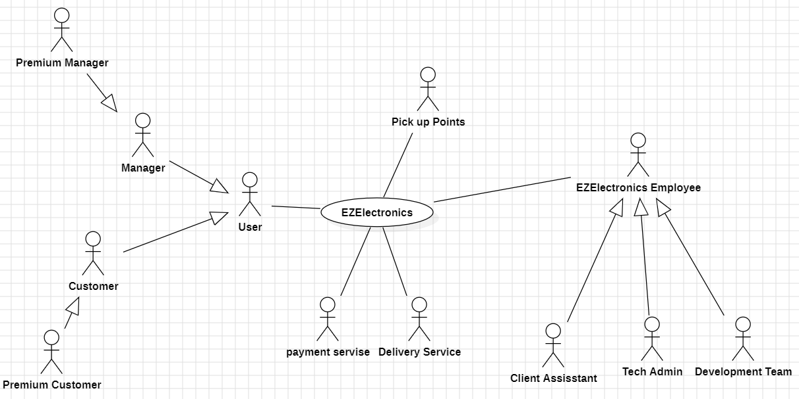

# Requirements Document - future EZElectronics

Date:

Version: V2 - description of EZElectronics in FUTURE form (as proposed by the team)

| Version number | Change |
| :------------: | :----: |
|      V2.0.1          |    Delete user usecase changes (should need authentication)    |

# Contents

- [Requirements Document - future EZElectronics](#requirements-document---future-ezelectronics)
- [Contents](#contents)
- [Informal description](#informal-description)
- [Stakeholders](#stakeholders)
- [Context Diagram and interfaces](#context-diagram-and-interfaces)
  - [Context Diagram](#context-diagram)
  - [Interfaces](#interfaces)
- [Stories and personas](#stories-and-personas)
- [Functional and non functional requirements](#functional-and-non-functional-requirements)
  - [Functional Requirements](#functional-requirements)
  - [Non Functional Requirements](#non-functional-requirements)
- [Use case diagram and use cases](#use-case-diagram-and-use-cases)
  - [Use case diagram](#use-case-diagram)
    - [Use case 1, UC1](#use-case-1-uc1)
      - [Scenario 1.1](#scenario-11)
      - [Scenario 1.2](#scenario-12)
      - [Scenario 1.x](#scenario-1x)
    - [Use case 2, UC2](#use-case-2-uc2)
    - [Use case x, UCx](#use-case-x-ucx)
- [Glossary](#glossary)
- [System Design](#system-design)
- [Deployment Diagram](#deployment-diagram)

# Informal description

EZElectronics (read EaSy Electronics) is a software application designed to help managers of electronics stores to manage their products and offer them to customers through a dedicated website. Managers can assess the available products, record new ones, and confirm purchases. Customers can see available products, add them to a cart and see the history of their past purchases.

# Stakeholders

| Stakeholder name | Description |
| :--------------: | :---------: |
| Customer  |       Users of Application who purchase product      |
| Manager, Premium Manager  |      Users of Application who sell product       |
| Start up Company  |    Developer of Software and Admins and CEO         |
| Product Company  |      The Company producing the Product       |
| Competitors  |       Competitor companies E.g. Ebay, Amazon retail, ...      |
| Payment Sevice   |       Online Payment service E.g. paypal      |

# Context Diagram and interfaces

## Context Diagram

## Interfaces

|   Actor   | Logical Interface | Physical Interface |
| :-------: | :---------------: | :----------------: |
| Users: Customer, Manager, Premium Manager |           PC        |       Web Page              |
| Tech Admin |         PC          |           Web Page         |
| Payment Service |       Internet Link           |       https://developer.paypal.com/api/rest/             |
| Data Base |      SQL           |      sqlite3              |

# Stories and personas

\<A Persona is a realistic impersonation of an actor. Define here a few personas and describe in plain text how a persona interacts with the system>

\<Persona is-an-instance-of actor>

\<stories will be formalized later as scenarios in use cases>

# Functional and non functional requirements

## Functional Requirements

\<In the form DO SOMETHING, or VERB NOUN, describe high level capabilities of the system>

\<they match to high level use cases>

|  ID   | Description |
| :---: | :---------: |
|  FR1: Manage Products  |     • FR1.0 Create a new Product(ONLY MANAGER) / Delete a Product(ONLY MANAGER)/ Delete all Products(ONLY TECH ADMIN)   • FR1.1 Registers the arrival of Products of same model (ONLY MANAGER)     • FR1.2 Mark a product as sold (ONLY MANAGER)   • FR1.3 Retrieve a product (All / with the same Category / Model)    • FR1.4 Registers the arrival of a set of products |
|  FR2: Manage Users  |   • FR2.0 Retrieves logged in user's Info.    • FR2.1 Retrieve a User (list of all users/ all users with a role / specific User with username)    •FR2.2 Create User / Delete User / Delete user with username / Delete all the users    |
|  FR3: Manage Cart  |      • FR3.0 Return the curent cart   • FR3.1 Add / Remove a product to cart     • FR3.2  Returns the history of the paid carts of the User   • FR3.3 Delete the cart of current user /Delete all carts |
|  FR4: Manage Payment  |     • FR4.0 Pay the current cart |
|  FR5: Authorization and Authentication  |       • FR5.0 Log in/Log out     |

## Non Functional Requirements

\<Describe constraints on functional requirements>

|   ID    | Type (efficiency, reliability, ..) | Description | Refers to |
| :-----: | :--------------------------------: | :---------: | :-------: |
|  NFR1   |                                    |             |           |
|  NFR2   |                                    |             |           |
|  NFR3   |                                    |             |           |
| NFRx .. |                                    |             |           |

# Use case diagram and use cases

## Use case diagram

### Use case 1, XXX

### Use case 2, Delete Account

| Actors Involved  |             Customer, Manager               |
| :--------------: | :------------------------------------------------------------------: |
|   Precondition   | User has account and is Logged in (authenticated) |
|  Post condition  | User has been Deleted his Account  |
| Nominal Scenario |  2.1 User has been Deleted his Account  |
|     Variants     |                                  |
|    Exceptions    |  2.2 Connection with database is lost and cannot delete the record    |

##### Scenario 2.1

|  Scenario 2.1  |       User has been Deleted his Account        |
| :------------: | :------------------------------------------------------------------------: |
|  Precondition  | User has account and is Logged in (authenticated) |
| Post condition |  User has been Deleted his Account |
|     Step#      |            Description                   |
|       1        |  The User Clicks on the Delete Account button    |
|       2        |  FR2.0 Retrieve the Logged in User Info   |
|       3        |  FR4.0 Perform Log out   |
|       4        |  FR.2.1 Delete User     |
|       5        |  A message pops up that your account has been deleted       |
|       6        |  Redirect user to the home page       |

##### Scenario 2.2

|  Scenario 2.1  |       Connection with database is lost and cannot delete the         |
| :------------: | :------------------------------------------------------------------------: |
|  Precondition  | User has account and is Logged in (authenticated) |
| Post condition |  User has been faced an Error |
|     Step#      |            Description                   |
|       1        |  The User Clicks on the Delete Account button    |
|       2        |  FR2.0 Retrieve the Logged in User Info   |
|       3        |  We got an Error from DataBase side |
|       5        |  An Error message pops up      |

# Glossary

\<use UML class diagram to define important terms, or concepts in the domain of the application, and their relationships>

\<concepts must be used consistently all over the document, ex in use cases, requirements etc>

# System Design

\<describe here system design>

\<must be consistent with Context diagram>

# Deployment Diagram

\<describe here deployment diagram >
