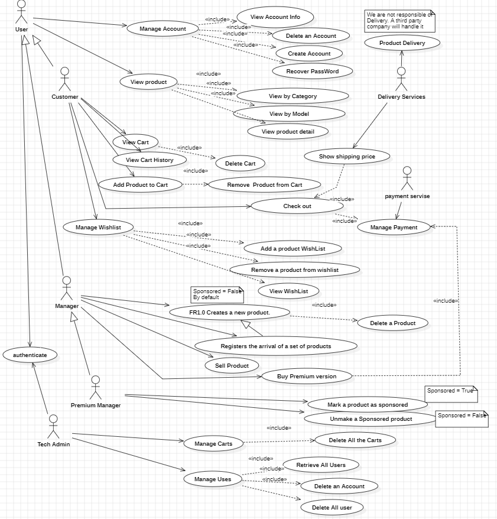

# Requirements Document - future EZElectronics

Date:

Version: V2 - description of EZElectronics in FUTURE form (as proposed by the team)

| Version number | Change |
| :------------: | :----: |
|      V2.0.1          |    Delete user usecase changes (should need authentication)    |

# Contents

- [Requirements Document - future EZElectronics](#requirements-document---future-ezelectronics)
- [Contents](#contents)
- [Informal description](#informal-description)
- [Stakeholders](#stakeholders)
- [Context Diagram and interfaces](#context-diagram-and-interfaces)
  - [Context Diagram](#context-diagram)
  - [Interfaces](#interfaces)
- [Stories and personas](#stories-and-personas)
- [Functional and non functional requirements](#functional-and-non-functional-requirements)
  - [Functional Requirements](#functional-requirements)
  - [Non Functional Requirements](#non-functional-requirements)
- [Use case diagram and use cases](#use-case-diagram-and-use-cases)
  - [Use case diagram](#use-case-diagram)
    - [Use case 1, UC1](#use-case-1-uc1)
      - [Scenario 1.1](#scenario-11)
      - [Scenario 1.2](#scenario-12)
      - [Scenario 1.x](#scenario-1x)
    - [Use case 2, UC2](#use-case-2-uc2)
    - [Use case x, UCx](#use-case-x-ucx)
- [Glossary](#glossary)
- [System Design](#system-design)
- [Deployment Diagram](#deployment-diagram)

# Informal description

EZElectronics (read EaSy Electronics) is a software application designed to help managers of electronics stores to manage their products and offer them to customers through a dedicated website. Managers can assess the available products, record new ones, and confirm purchases. Customers can see available products, add them to a cart and see the history of their past purchases.

# Stakeholders

| Stakeholder name | Description |
| :--------------: | :---------: |
| Customer  |       Users of Application who purchase product      |
| Manager, Premium Manager  |      Users of Application who sell product       |
| Start up Company  |    Developer of Software and Admins and CEO         |
| Product Company  |      The Company producing the Product       |
| Competitors  |       Competitor companies E.g. Ebay, Amazon retail, ...      |
| Payment Sevice   |       Online Payment service E.g. paypal      |
| Pick up points   |    Physical location for shipping and pickup with the help of delivery services.    |
| Delivery Services   |       The Service provieds delivery E.G. DHL    |

# Context Diagram and interfaces

## Context Diagram

## Interfaces

|   Actor   | Logical Interface | Physical Interface |
| :-------: | :---------------: | :----------------: |
| Users: Customer, Manager, Premium Manager, Premium Customer |           PC        |       Web Page              |
| Tech Admin |         PC          |           Web Page         |
| Payment Service |       Internet Link           |       https://developer.paypal.com/api/rest/             |
| Data Base |      SQL           |      sqlite3              |
| Delivery Service |      Internet Link           |      https://developer.dhl.com/api-catalog              |

# Stories and personas
1.	Persona: Giulia - Electronics Store Manager
      
      •	Background: 
      1.	Giulia is the manager of a small electronics store. 
      2.	She's tech-savvy but lacks experience in managing online platforms.
      
      •	Story: 
      1.	Giulia needs a solution to streamline her store's operations and expand its reach online. She discovers EZElectronics and sees its potential to simplify inventory management and reach a wider customer base. 
      2.	She uses the platform to easily add new products, update stock levels, and fulfill online orders, ultimately boosting her store's revenue.

2.	Persona: Marco - Tech Customer

    •	Background: 
    1.	Marco is a college student with a passion for electronics. 
    2.	He frequently shops online for the latest gadgets and components.

    •	Story: 
    1.	Marco comes across EZElectronics while searching for a specific electronic component. Impressed by the website's user-friendly interface and diverse product range, he creates an account and starts browsing. He finds the component he needs, adds it to his cart, and completes the purchase hassle-free. 
    2.	Satisfied with his experience, Marco becomes a loyal customer, regularly checking EZElectronics for new arrivals.

3.	Persona: Tommaso - Tech Admin

    •	Background: 
    1.	Tommaso is the tech admin at EZElectronics, responsible for overseeing the development and maintenance of the software application. 
    2.	He has a strong passion for technology and innovation.
    
    •	Story: 
    1.	Tommaso is tasked with leading the development team in enhancing EZElectronics to meet the evolving needs of electronics store managers and customers. He conducts regular meetings to gather feedback from users and identifies areas for improvement. 
    2.	Tommaso works closely with the development team to implement new features and optimize the platform's performance. Through his expertise and dedication, Tommaso ensures that EZElectronics remains a top choice for electronics retailers seeking a reliable and user-friendly management solution.

4.	Persona: Sofia - Premium Customer

    •	Background: 
    1.	Sofia is a frequent shopper at EZElectronics and has opted for the premium membership, which offers benefits like free shipping and exclusive deals.
    
    •	Story: 
    1.	Sofia, being a premium member, enjoys the perks of free shipping on all her purchases from EZElectronics. She appreciates the convenience and cost savings this offers, making her more inclined to shop regularly on the platform. 
    2.	Additionally, Sofia feels valued as a customer due to the exclusive deals and personalized recommendations she receives as part of her premium membership.

5.	Persona: Matteo - Premium Manager

    •	Background: 
    1.	Matteo is the manager of a top-performing electronics store that partners with EZElectronics. 
    2.	He has opted for the premium manager package, which includes premium placement of his products on the website's top pages.
    
    •	Story: 
    1.	Matteo leverages his premium manager status on EZElectronics to ensure that his products receive maximum visibility on the platform. With his products featured prominently on the top pages of the website, Matteo attracts more customers and drives higher sales for his store.
    2.	He appreciates the additional exposure and marketing support provided by EZElectronics, which helps him stay ahead of the competition and grow his business.

# Functional and non functional requirements

## Functional Requirements

\<In the form DO SOMETHING, or VERB NOUN, describe high level capabilities of the system>

\<they match to high level use cases>

|  ID   | Description |
| :---: | :---------: |
|  FR1: Manage Products  |     • FR1.0 Create a new Product(ONLY MANAGER) / Delete a Product(ONLY MANAGER)/ Delete all Products(ONLY TECH ADMIN)   • FR1.1 Registers the arrival of Products of same model (ONLY MANAGER)     • FR1.2 Mark a product as sold    • FR1.3 Retrieve a product (All / with the same Category / Model)    • FR1.4 Registers the arrival of a set of products    • FR1.5 Add a Product as sponssored (ONLY BY PREMIUM MANAGER)  • FR1.6 Sponsor products (ONLY PREMIUM MANAGER) |
|  FR2: Manage Users  |   • FR2.0 Retrieves logged in user's Info.    • FR2.1 Retrieve a User (list of all users/ all users with a role (ONLY TECH ADMIN) / specific User with username)    •FR2.2 Create User / Delete User(USER AND TECH ADMIN) / Delete user with username  / Delete all the users (ONLY TECH ADMIN)     •FR2.3 Create Premium User  • FR2.4 Choose to be Premium User (Manager or Customer)|
|  FR3: Manage Cart  |      • FR3.0 Return the curent cart   • FR3.1 Add / Remove a product to cart     • FR3.2  Returns the history of the paid carts of the User   • FR3.3 Delete the cart of current user (USER) /Delete all carts (ONLY TECH ADMIN) |
|  FR4: Manage Payment  |     • FR4.0 Choose a payment method  • FR4.1 Pay the current cart  • FR4.2 Pay the Premium Account  |
|  FR5: Authorization and Authentication  |       • FR5.0 Log in/Log out    • FR5.1 Password Recovery   |
|  FR6: Manage Shipping  |     • FR6.0 Choose a shipping method (Delivery Company)   • FR6.1 Show the shipping price   • FR6.2 Insert Address   • FR6.3 Track delivery  • FR6.4 Zero out shipping costs (ONLY PREMIUM CUSTOMER)|
|  FR7: Manage Whishlist  |      • FR7.0 Return the curent whislist   • FR7.1 Add / Remove a product to whislist (ONLY CUSTOMER) |

## Non Functional Requirements

\<Describe constraints on functional requirements>

|   ID    | Type (efficiency, reliability, ..) | Description | Refers to |
| :-----: | :--------------------------------: | :---------: | :-------: |
|  NFR1   |              Reliability                      |      • No more than one defect per user      |      All Functions     |
|  NFR2   |                 Usability                   |      •  Customer should be able to use Web app with no training less than 2 min.       |     FR3, FR4, FR5      |
|  NFR3   |                 Usability                   |      • Manager  should be able to use Web app with no training less than 5 min.       |     FR1, FR5      |
|  NFR4   |                 Efficiency                   |    • Website should be loaded in less than 2 sec   • execution of functions take less than 0.1 sec      |      All Functions     |
| NFR5 |               Portability                     |     • Web App  should be compatible with different browsers (Chrome, Edge, Safari, Mozila)    |     All Functions      |
| NFR6 |               Portability                     |     • Web App  should have different versrions for Devices (Desktop Version, Smartphone Version)     |     All Functions      |
| NFR7 |               Privacy                     |     • Customer data should not be used for commercial purposes in other companies and the purchase history should be available just for the Customer and the Company.     |     FR2, FR3      |
| NFR8 |               Security                     |     • The user information should be saved in data base in encrypted format and the payment portal shouold be safe   |     FR2, FR4, FR5      |

# Use case diagram and use cases

## Use case diagram

### Use case 1, XXX

### Use case 2, Delete Account

| Actors Involved  |             Customer, Manager               |
| :--------------: | :------------------------------------------------------------------: |
|   Precondition   | User has account and is Logged in (authenticated) |
|  Post condition  | User has been Deleted his Account  |
| Nominal Scenario |  2.1 User has been Deleted his Account  |
|     Variants     |                                  |
|    Exceptions    |  2.2 Connection with database is lost and cannot delete the record    |

##### Scenario 2.1

|  Scenario 2.1  |       User has been Deleted his Account        |
| :------------: | :------------------------------------------------------------------------: |
|  Precondition  | User has account and is Logged in (authenticated) |
| Post condition |  User has been Deleted his Account |
|     Step#      |            Description                   |
|       1        |  The User Clicks on the Delete Account button    |
|       2        |  FR2.0 Retrieve the Logged in User Info   |
|       3        |  FR4.0 Perform Log out   |
|       4        |  FR.2.1 Delete User     |
|       5        |  A message pops up that your account has been deleted       |
|       6        |  Redirect user to the home page       |

##### Scenario 2.2

|  Scenario 2.1  |       Connection with database is lost and cannot delete the         |
| :------------: | :------------------------------------------------------------------------: |
|  Precondition  | User has account and is Logged in (authenticated) |
| Post condition |  User has been faced an Error |
|     Step#      |            Description                   |
|       1        |  The User Clicks on the Delete Account button    |
|       2        |  FR2.0 Retrieve the Logged in User Info   |
|       3        |  We got an Error from DataBase side |
|       5        |  An Error message pops up      |

### Use case 4, View Product List

| Actors Involved  |             Customer, Manager               |
| :--------------: | :------------------------------------------------------------------: |
|   Precondition   | User has an account and Logged in (Authenticated) |
|  Post condition  | User see the result as list of products   |
| Nominal Scenario |  4.1 User Views the product list based on Model  - Sponsored product on Top   4.2 User Views the product list based on Category - Sponsored product on Top  |
|     Variants     |  4.3 User Views the product list without Sponsored product on Top        |
|    Exceptions    |  4.4 No Product Found based on the criteria    |

##### Scenario 4.1

|  Scenario 4.1  |       User Views the product list based on Model - Sponsored product on Top      |
| :------------: | :------------------------------------------------------------------------: |
|  Precondition  | User has an account and Logged in (Authenticated) |
| Post condition |  User Views the product list based on Model |
|     Step#      |            Description                   |
|       1        |  The User Clicks on the View by Model button    |
|       2        |  FR1.3 Retrieve product list with same model  |
|       3        |  the list of products with same model show up in the web page  |

##### Scenario 4.2

|  Scenario 4.2  |       User Views the product list based on Category - Sponsored product on Top     |
| :------------: | :------------------------------------------------------------------------: |
|  Precondition  | User has an account and Logged in (Authenticated) |
| Post condition |  User Views the product list based on Category |
|     Step#      |            Description                   |
|       1        |  The User Clicks on the View by Category button    |
|       2        |  FR1.3 Retrieve product list with same Category  |
|       3        |  the list of products with same Category show up in the web page  |

##### Scenario 4.3

|  Scenario 4.3  |       User Views the product list without Sponsored product on Top       |
| :------------: | :------------------------------------------------------------------------: |
|  Precondition  | User has an account and Logged in (Authenticated) |
| Post condition |  User Views the product list based on Catagory/Model without Sponsored product on Top |
|     Step#      |            Description                   |
|       1        |  The User Clicks on the View by Category/Model button    |
|       2        |  FR1.3 Retrieve product list with same Category/Model  |
|       3        |  Database Retrieves the list  |
|       4        |  The list of products with same Category/Model show up in the web page  |

##### Scenario 4.4

|  Scenario 4.4  |       No Product Found based on the criteria       |
| :------------: | :------------------------------------------------------------------------: |
|  Precondition  | User has an account and Logged in (Authenticated) |
| Post condition |  No Product Found based on the criteria |
|     Step#      |            Description                   |
|       1        |  The User Clicks on the View by Category button    |
|       2        |  FR1.3 Retrieve product list with same Category  |
|       3        |  Database Retrieves: Null  |
|       4        |  This message pops up: No Product Found based on the criteria  |

### Use case 5, View Product details

| Actors Involved  |             Customer, Manager               |
| :--------------: | :------------------------------------------------------------------: |
|   Precondition   | User has an account and Logged in (Authenticated) |
|  Post condition  | User see the details of product including the image and description   |
| Nominal Scenario |  5.1 User Views the product details (is not sponsored)   5.2 User Views the sponsored product details |
|     Variants     |          |
|    Exceptions    |  5.3 404 Error - The Product Found    |

##### Scenario 5.1

|  Scenario 5.1  |       User Views the product details (is not sponsored)      |
| :------------: | :------------------------------------------------------------------------: |
|  Precondition  | User has an account and Logged in (Authenticated) |
| Post condition |  User see the details of product (is not sponsored) including the image and description |
|     Step#      |            Description                   |
|       1        |  The User Clicks on a normal Product   |
|       2        |  FR1.3 Retrieve a product  |
|       3        |  DataBase Retrieves the details of a normal product  |
|       4        |  The Detail of the normal product are shown to the user   |

##### Scenario 5.2

|  Scenario 5.2  |       User Views the sponsored product details     |
| :------------: | :------------------------------------------------------------------------: |
|  Precondition  | User has an account and Logged in (Authenticated) |
| Post condition |  User see the details of Sponsored product including the image and description |
|     Step#      |            Description                   |
|       1        |  The User Clicks on a Sponsored Product    |
|       2        |  FR1.3 Retrieve a product  |
|       3        | DataBase Retrieves the details of an Sponsored product  |
|       4        |  The Detail of the sposnsored product are shown to the user   |

##### Scenario 5.3

|  Scenario 5.3  |       404 Error - The Product Found        |
| :------------: | :------------------------------------------------------------------------: |
|  Precondition  | User has an account and Logged in (Authenticated) |
| Post condition |  User Encounters an Error - THe Product Found |
|     Step#      |            Description                   |
|       1        |  The User Clicks on a product    |
|       2        |  FR1.3 Retrieve a product  |
|       3        |  Database Reruens an Error  |
|       4        |  This error msg pops up: 404 Error - The Product Found  |

### Use case 6, View Cart 

| Actors Involved  |             Customer               |
| :--------------: | :------------------------------------------------------------------: |
|   Precondition   | User has an account and Logged in as Customer (Authenticated) |
|  Post condition  | Customer view the Details of the cart   |
| Nominal Scenario |  6.1 Customer can view the details of his cart |
|     Variants     |                                  |
|    Exceptions    |  6.2 No Product in the cart.    |

##### Scenario 6.1

|  Scenario 5.1  |       Customer view the Details of the cart       |
| :------------: | :------------------------------------------------------------------------: |
|  Precondition  | User has an account and Logged in as Customer (Authenticated) |
| Post condition |  Customer view the Details of the cart |
|     Step#      |            Description                   |
|       1        |  The Customer Clicks on the View Cart button    |
|       2        |  FR3.0 Return the curent cart |
|       3        |  The Cart details will be Displayed on the web page |

##### Scenario 6.2

|  Scenario 5.2  |       No Product in the Cart       |
| :------------: | :------------------------------------------------------------------------: |
|  Precondition  | User has an account and Logged in as Customer (Authenticated) |
| Post condition |  Customer see No Product has been added to cart Message. |
|     Step#      |            Description                   |
|       1        |  The Customer Clicks on the View Cart button    |
|       2        | FR3.0 Return the curent cart |
|       3        |  DataBase returns NULL |
|       3        |  "No Product has been added to the cart. Keep Shopping.." will pops up. |

# Glossary

\<use UML class diagram to define important terms, or concepts in the domain of the application, and their relationships>

\<concepts must be used consistently all over the document, ex in use cases, requirements etc>

# Deployment Diagram

\<describe here deployment diagram >
